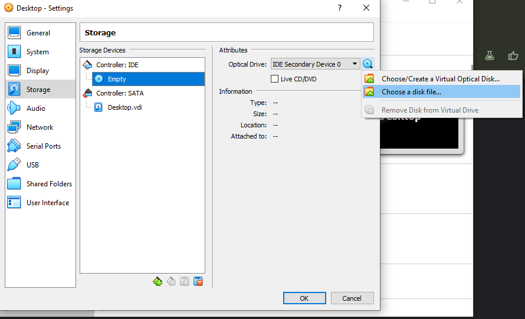
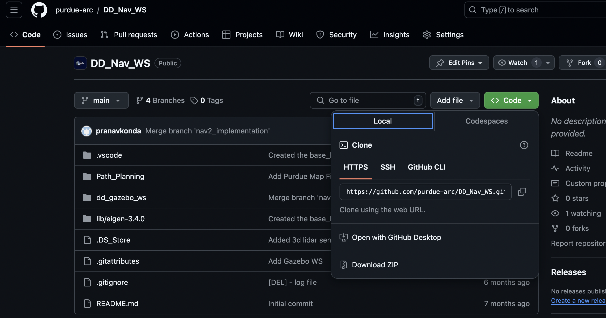
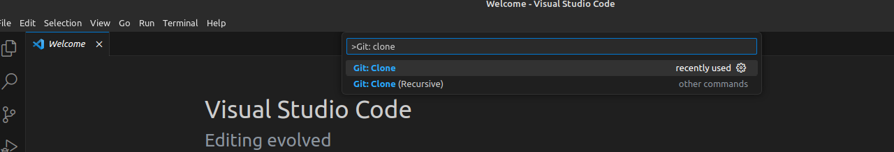
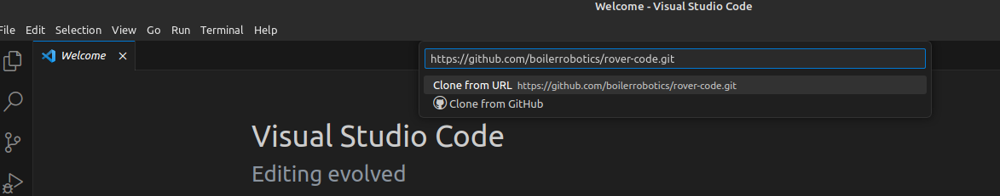
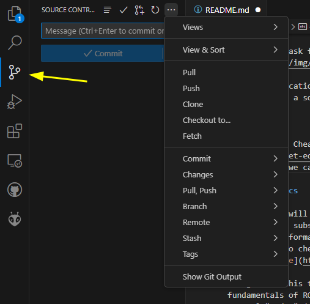

# Tutorial Module

The goal is of this tutorial is to give new members fundamental understanding of software and frameworks that we use to operate the rover.
By the end of this tutorial, you should understand following topics

- Basic Git workflow
- Why and how to use Robot Operating System (ROS)
- How to communicate between multiple machines
- Create and control a rover in Gazebo (simulator)

Please note that this tutorial only touches the surface of software development world.
It is highly recommend to reading more documents or tutorials and keep practicing.
Additionally, Linux, ROS, Gazebo and many other pieces of software we use are in active development.
It means that new features are adding continuously.
Please feel free to submit pull requests for updating/revising this tutorial.

## Git

### What are Git and GitHub? Why should you use it?

**Git** is a version control system that will keep tracking changes of your code.
There are other version control systems, for example, [Subversion (SVN)](https://subversion.apache.org/) or [Mercurial](https://www.mercurial-scm.org/).
However, Git is the most popular choice as it is easy to use and supported by many cloud source code hosting platforms.

**GitHub** is a cloud platform to host your source code that using Git.
It not only host your code, but also has multiple features for collaborating among developers, such as issues, discussions, or project boards.
There are other platforms e.g.
[GitLab](https://about.gitlab.com/why-gitlab/) or [Bitbucket](https://bitbucket.org/product).
But GitHub is the most popular choice.

With Git, you will no longer need to create a multiple files as back up.
You can see a full history of your development.
In each commit, you will see the timestamp, comments, and changes line by line.
You will be able to reactivate to any commits at anytime.

Branching is also a powerful feature of Git.
By default, your repository has a "main" (or master) branch.
You can create branches from the main branch or any branches.
You (or your team) will add new code or features to branches instead of the main branches.
Until the point that you feel that the new features are ready (usually after testing and review), you can create a **pull request** to merge your branch back to the main branch.
This procedure will ensure that your main branch is always clean and contain functional code.

[Here is a tutorial on the basics](https://github.com/JLZ22/Git-Tutorial-for-New-Users/tree/main) (please consider giving it a star if its helpful).

**Note** GitHub could be your online coding portfolio/resume.
There is a high chance that the potential employers will look at your GitHub.
It is a good idea to have one and know how to use it.

<!-- ### Git Workflow -->

## Install Software

Our core software framework is Robot Operating System or [ROS](https://www.ros.org/).
There are legacy ROS which is no longer actively developed.
The latest version (Noetic) will reach End of Life in May 2025.
Therefore, we will use ROS 2 instead.
We will use ROS or ROS 2 interchangeably and it will always refer to ROS 2.
ROS can run on many operating systems but we highly recommend you to use it with Ubuntu.
We also highly recommend to create a virtual machine and install ROS on it.
Therefore, you will not mess up with your host machine.
The list below is software you need to install.

1. [Ubuntu 22.04](https://releases.ubuntu.com/jammy/) (LTS - Long Term Support). This is a first tier support by ROS.
   You are welcome to choose any [flavors](https://ubuntu.com/desktop/flavours) that you want.

2. [ROS 2 Humble](https://docs.ros.org/en/humble/Installation/Ubuntu-Install-Debians.html).

Since ROS can requires Ubuntu, if your machine is not running Ubuntu, you will have a few options as follow.

Note. Any distro in Ubuntu family will work, such as, Kubuntu, Lubuntu, Linux Mint, POP! OS.

Note2. ROS has 3 tiers of target OS, you can check [here](https://www.ros.org/reps/rep-2000.html#humble-hawksbill-may-2022-may-2027). It is possible that you can use ROS directly without Ubuntu.

| Platform | VM                                         | WSL | Docker |
| -------- | ------------------------------------------ | --- | ------ |
| Windows  | [Link](#virtual-box-for-windows-and-linux) |     |
| MacOS    | [link](https://mac.getutm.app/)            | NA  |
| Linux    | [Link](#virtual-box-for-windows-and-linux) | NA  |

<!-- ### Option Comparison -->

<!-- #### Dual-boot -->

<!-- #### Virtual Machine (VM) -->

<!-- #### Windows Linux Subsystem -->

<!-- #### Docker  -->

### Virtual Box (For Windows and Linux)

1. Create a new virtual machine.
   We recommend to set the machine spec as following

- Type: Linux
- Version: Ubuntu (64-bit)
- Memory: 4096 MB or more (If you local machine has less than 8GB of RAM, you may need to use lightweight Ubuntu instead)
- Virtual Hard Drive: 35 GB or more (You will create a Dynamic VirtualBox Disk Image.
  It will take the actual space the VM use but not more than 35 GB or at the capacity you allow it to use)

2. Mount the Ubuntu ISO that you download by clicking settings -> Storage.
   Click on CD drive icon then choose the disk file.



3. Start the machine.
   You will follow the installation instruction.
   Along the process, you will be a admin of this virtual machine.
   The password that you choose for it is important.
   If you forget the password, there is no way to recover it.
   You will need this password to install software packages later.

### ROS Installation Guide

1. Follow this [tutorial](https://docs.ros.org/en/humble/Installation/Ubuntu-Install-Debians.html) to install ROS.

2. You can choose either (but not both) "desktop" or "base".
   The base version has everything we are using right now.
   The desktop version has tools that could be beneficial but we don't use it often.
   If you choose to install the base version, keep in mind that you might not be able to run some commands.
   For more detail about the difference, check this [document](https://www.ros.org/reps/rep-2001.html#humble-hawksbill-may-2022-may-2027).

3. At the end, run the following command, it will add a script to activate ROS every time you open the new terminal.

```bash
echo "source /opt/ros/humble/setup.bash" >> ~/.bashrc
```

4. Install `colcon`. It is a package manager.

```bash
sudo apt install python3-colcon-common-extensions
```

### Visual Studio Code and GitHub

We recommend using [Visual Studio Code ](https://code.visualstudio.com/)(VS Code) for writing code.
It comes with extensions that will make coding much easier.
You will need to install [Git](https://git-scm.com/).
For Ubuntu, run the following command to on the terminal

```bash
sudo apt install git
```

Now, you have everything ready to clone the source code and start editing.
You have two options to clone the source code: command or VS Code.
This tutorial will only cover the VS Code option.
First, copy the source code URL from GitHub.


On the VS Code, click View -> Command Palette (Ctrl + Shift + P) then type `git: clone`.


VS Code will ask for the URL.


Select the location that you want to keep the source code.
Then you have a source code in your local machine.

### VS Code Extensions

This is a list of recommended extensions

- [ROS](https://marketplace.visualstudio.com/items?itemName=ms-iot.vscode-ros)
- [IntelliCode](https://marketplace.visualstudio.com/items?itemName=VisualStudioExptTeam.vscodeintellicode)
- [Black Formatter](https://marketplace.visualstudio.com/items?itemName=ms-python.black-formatter)
- [Prettier - Code formatter](https://marketplace.visualstudio.com/items?itemName=esbenp.prettier-vscode)

## Git 101

Check out Git Cheat Sheet [here](https://education.github.com/git-cheat-sheet-education.pdf).
Fortunately, we can do most of the tasks in VS Code.
In the "Source Control" tab, you will find all Git commands.



every time before making any commits, make sure that you are working in the correct branch.
By default, you will be in the main (or master) branch.
This branch is protected.
You cannot make any chances to on this branch directly.
You will need to create another branches then submitting a pull request after you finish the task.

Making commit is a two-steps process.
First, you will need to stage "changes".
It means you will need to tell Git which files you want to include in this commit.
Next, you will write a commit message then commit.
At this point, the commit is made in your local machine.
You can either push the commit(s) to GitHub.
Note that you can undo your local commits.
But once you push to GitHub, it is irreversible.

## ROS 2 Basics

This section will cover most of what you will need to set up a publisher and subscriber through ROS2.
If you ever want additional information on what other things can be done with ROS or want to check some information, their documentation can be found [here](https://docs.ros.org/en/humble/Tutorials.html).

The goal of this tutorial is to familiarize you with the fundamentals of ROS communication.
This is primarily done by several "nodes" (essentially single pieces of independent code) sending and receiving messages.
For more details on ROS concepts, check this [tutorial](https://docs.ros.org/en/humble/Concepts/Basic.html).

### Creating a ROS 2 workspace

In order to start working with nodes through ROS, you will first need to create the workspace that they will run in.
Whenever working with multiple nodes, you will want to start by setting a value called your ROS Domain ID.
This essentially sets your ROS up so that nodes will be able to communicate with each other but it will ignore unrelated nodes on the same network.
Each time you open a terminal, you can set this by running the command

```
export ROS_DOMAIN_ID=<your_domain_id>
```

where your_domain_id is any integer between 0 and 101.
Once you have your domain id set, make sure that you consistently use the same number for other instances that you want to work together.

A workspace is the directory you have ROS 2 packages in.
A package is an organizational unit for your code, which allows it to be run as a node and work with other ROS features.
To start, you'll want to make and enter a directory for your workspace.

```
mkdir -p ~/ros2_ws/src
cd ~/ros2_ws/src
```

Feel free to name your workspace folder whatever you would like, but make sure that it still contains the src folder, which is very important to a lot of ROS functionality.

## Writing Publisher and Subscriber Nodes

The simplest form of communication between nodes is a publisher and subscriber setup.
One node will write a message to a specific topic (basically just a named place where the value will exist) and another node repeatedly checks that topic to see if anything has been sent.
This kind of system is very useful for much of what we need for the rover.
For example, one node can constantly publish the state of a joystick and another node can read this in and convert it to motor outputs.

Please go through the [talker and listener tutorial](https://docs.ros.org/en/humble/Tutorials/Beginner-Client-Libraries/Writing-A-Simple-Py-Publisher-And-Subscriber.html) provided in the ROS 2 documentation.
This tutorial is very thorough and we strongly recommend that you do the entire process and read it carefully, particularly the section describing how the talker and listener code actually works, as this will be critical to understanding rover communication.

## Communicating Across Machines

Now that you have made a publisher and subscriber, you've successfully gotten communication between 2 nodes running on the same machine.
The next step is to do the same process between multiple computers.
The goal of this step is to successfully broadcast your name and have it appear on another computer.

In order to do this, you will first want to make a few changes to your publisher code.
First of all, alter the message being sent so that it now says your name instead of constantly counting.
Then, you will need to set the topic to "name".
Your publisher's topic needs to match the topic of the subscriber, so this is what we will be using in this example.

You will also need to change your network settings in VirtualBox.
Under Network, you will just need to change from NAT to Bridged Adapter so that you can send and receive messages.
Once you have done this and are connected to the same network as the subscriber node, make sure your domain id matches that of the receiving computer.

## Gazebo

Gazebo is a robot simulator software.
Gazebo can run as a standalone software in all OS, but in our case, we want to run Gazebo along with ROS.
Therefore, we can test our ROS code.
To install Gazebo, run the following command

```bash
 sudo apt install ros-humble-ros-gz
```

This command will install Gazebo Fortress as it is the recommended version to work with ROS Humble.
When you read the document or tutorial, double-check the version of it.
There are some differences as follow.

| Differences  | Fortress           | Harmonic   |
| ------------ | ------------------ | ---------- |
| sdf version  | 1.8                | 1.10       |
| plug-in name | libignition-gazebo | gz-sim     |
| command      | ros_ign_xxx        | ros_gz_xxx |

### Create a robot model

Gazebo has good tutorials.
It is recommended to go through all of them to understand the overall concept.
Then follow the first two tutorials ([Building your own robot](https://gazebosim.org/docs/fortress/building_robot/) & [Moving the robot](https://gazebosim.org/docs/fortress/moving_robot/)).

### Connect with Gazebo and ROS

During above Gazebo tutorial, you created a keyboard interface by Gazebo.
It should work fine, but we won't use Gazebo with the real rover.
So, the code that send command (the Twist message) should be created and sent in from the ROS working space.
Recall from [Writing Publisher and Subscriber Nodes](#writing-publisher-and-subscriber-nodes) section, you already wrote a publisher that send simple texts.
Next step, you will create another publisher that read keyboard input then send the Twist message to control the rover in Gazebo.
Keep in mind that even you make a right publisher that send the Twist message on `cmd_vel` topic, Gazebo robot won't react.
This is because, by default, ROS and Gazebo world are not connected.
To connect these two worlds, follow this [tutorial](https://gazebosim.org/docs/fortress/ros2_integration/)

<!-- ### Control the robot with joystick -->

## Resources

- Very good basic ROS tutorial from [Articulated Robotics](https://beta.articulatedrobotics.xyz/tutorials/)
- ROS official [concept](https://docs.ros.org/en/humble/Concepts.html) and [tutorial](https://docs.ros.org/en/humble/Tutorials.html)
